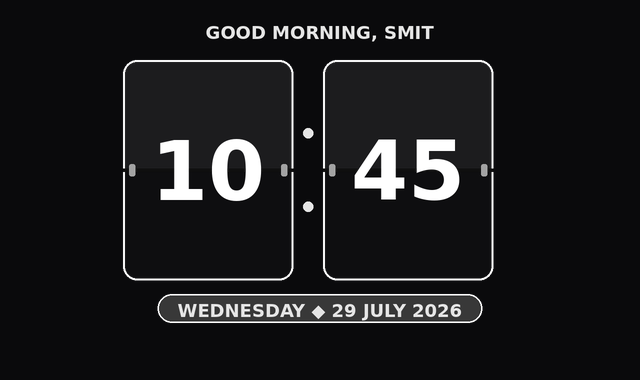
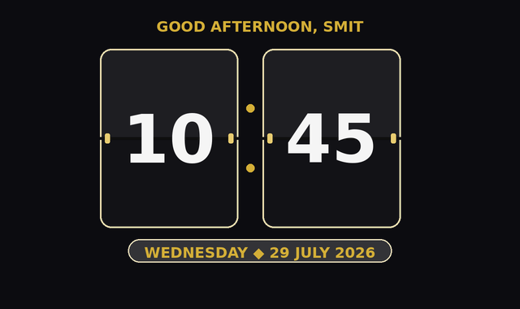
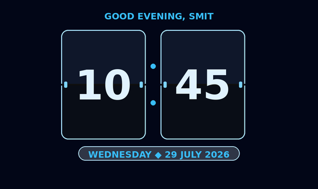
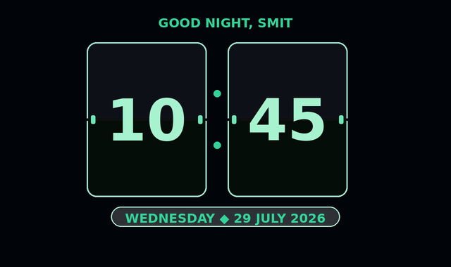
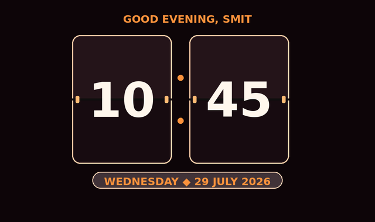
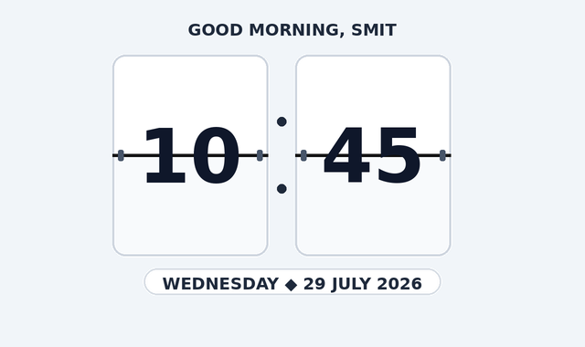

# Premium Fliqlo-Style Flip Clock Screensaver for Ubuntu

[](https://ubuntu.com)
[](https://raw.githubusercontent.com/smit-darji/ubuntu-flipclock-screensaver/Master/ubuntu-flipclock-screensaver_2.0.0_all.deb)
[](https://www.python.org/)
[](LICENSE)

---

## 📷 Themes & Visual Previews

A native, high-fidelity, multi-monitor flip clock screensaver for Ubuntu Linux. It brings a vintage airport split-flap style retro clock to your workstation, rendering across all connected displays simultaneously with smooth 3D CSS animations, dynamic time-based greetings, and multi-theme personalization.

| Theme Name | Visual Screenshot Preview |
|---|---|
| **1. Classic Retro (Fliqlo Style)** *(Default)* |  |
| **2. Dark Luxury (Gold Accent)** |  |
| **3. Midnight Cyber (Neon Blue)** |  |
| **4. Emerald OLED (Matrix Green)** |  |
| **5. Sunset Glow (Amber / Crimson)** |  |
| **6. Minimalist Light (Clean Silver)** |  |

---

## ✨ Key Features

* **Vintage Split-Flap Clock UI**: Fliqlo-style charcoal cards, subtle border highlights, rounded corners, and realistic 3D card flip shadows.
* **Time-based Personalized Greetings**:
  - Automatically displays greetings based on time of day: `GOOD MORNING`, `GOOD AFTERNOON`, `GOOD EVENING`, `GOOD NIGHT`.
  - Personalize with your custom name (e.g. `GOOD MORNING, SMIT`).
  - Toggle greeting visibility on or off via checkbox/switch in settings.
* **6 Premium Visual Themes & Color Layouts**:
  1. **Classic Retro (Fliqlo Style)** (*Default Theme*) - Pitch black background, matte dark cards, crisp white digits.
  2. **Dark Luxury (Gold Accent)** - Deep charcoal plates, metallic gold hinges & separator dots.
  3. **Midnight Cyber (Neon Blue)** - Slate navy plates, neon cyan glowing accents.
  4. **Emerald OLED (Matrix Green)** - True pitch black cards, emerald green digits & side pins.
  5. **Sunset Glow (Amber / Crimson)** - Warm dusk gradient background with glowing copper/orange accents.
  6. **Minimalist Light (Clean Silver)** - Light frosted glass cards, dark charcoal numbers, clean silver pins.
* **Multi-Monitor Support**: Automatically detects monitor count, geometry, and placement to spawn independent full-screen screensaver windows per display.
* **Aspect-Ratio Scaling**: Dynamically adjusts visual scale using CSS transforms. Adapts seamlessly to ultra-wide, standard, and portrait (vertical) monitors without cut-offs.
* **Modern Dark GTK Settings Application**:
  - **Active Theme Selector**
  - **Display Time Greeting** toggle & **Custom User Name** input
  - **Time Format** (12-Hour AM/PM vs 24-Hour)
  - **Seconds Display** toggle & **Date Badge** toggle
  - **Clock Scale Slider** (`0.5x` to `2.0x`)
  - **Idle Timeout Selector** (1, 2, 3, 5, 10, 15, 30 min, 1 hr)
  - **Test Preview** & **Save & Apply** buttons
* **Zero CPU Overhead**: Background idle monitoring daemon queries native X11 Screen Saver extension (`libXss` via `ctypes`) resulting in **0.0% idle CPU utilization**.

---

## 🚀 Installation Methods

### Method 1: Install Debian Package (`.deb`) — *Recommended*

Download `ubuntu-flipclock-screensaver_2.0.0_all.deb` and install via `apt` (which automatically resolves required system dependencies):

```bash
# 1. Move to the screensaver project directory
cd /home/dev1035/dev-1035/smit.softvan.com/screensaver

# 2. Install package using apt
sudo apt update
sudo apt install ./ubuntu-flipclock-screensaver_2.0.0_all.deb
```

---

### Method 2: Install from Source

```bash
# 1. Clone the repository
git clone https://github.com/smit-darji/ubuntu-flipclock-screensaver.git
cd ubuntu-flipclock-screensaver

# 2. Install required system dependencies
sudo apt update
sudo apt install python3 python3-gi gir1.2-gtk-3.0 gir1.2-webkit2-4.0 libxss1

# 3. Run the installer script
chmod +x install.sh
./install.sh
```

---

## ⚙️ Configuration & GUI Settings

Open **"Flip Clock Settings"** from Ubuntu Applications menu, or run in terminal:
```bash
flipclock --settings
```

### Configuration File (`~/.config/flipclock/flipclock.conf`)
```ini
[Settings]
idle_timeout = 60         # Idle time in seconds before screensaver starts (e.g., 60 = 1 minute)
hour_format = 12           # Time format: 12 (AM/PM) or 24 (24-Hour)
clock_size = 1.0           # Scaling factor (0.5 to 2.0)
animation_speed = 500      # Flip transition duration in ms
monitors = all             # Targets: "all" or specific monitor indices (e.g. "0,1")
theme = classic_retro      # Active theme: classic_retro, dark_gold, midnight_cyber, emerald_oled, sunset_glow, minimal_light
show_seconds = true        # Toggle seconds flip card visibility
show_date = true           # Toggle date badge visibility
show_greeting = true       # Toggle time-based greeting visibility
user_name = Smit           # Custom name for greeting (e.g. GOOD MORNING, SMIT)
custom_credit = Customized by Antigravity AI
```

---

## 💡 Usage & CLI Commands

Once installed, the following commands are available globally in your terminal:

| Command | Action |
|---|---|
| `flipclock` or `flipclock --run` | Previews/launches screensaver full-screen windows immediately |
| `flipclock --settings` | Opens the graphical settings configuration window |
| `flipclock --theme <theme_id> --run` | Previews specific theme directly (`classic_retro`, `dark_gold`, `midnight_cyber`, `emerald_oled`, `sunset_glow`, `minimal_light`) |
| `flipclock --version` | Outputs current software version (`v2.0.0`) |
| `flipclock --daemon` | Starts the background idle monitor daemon |
| `pkill -f "flipclock.*--daemon"` | Stops the background idle monitor daemon |

---

## 🛠️ Building `.deb` Package from Source

To build a fresh `.deb` package file locally:

```bash
chmod +x build_deb.sh
./build_deb.sh
```
This generates `ubuntu-flipclock-screensaver_2.0.0_all.deb` in the project root directory.

---

## 🗑️ Uninstallation Guide

To completely remove the application package, system symlinks, launchers, and autostart entries:

```bash
sudo apt remove flipclock-screensaver
sudo apt purge flipclock-screensaver
```
